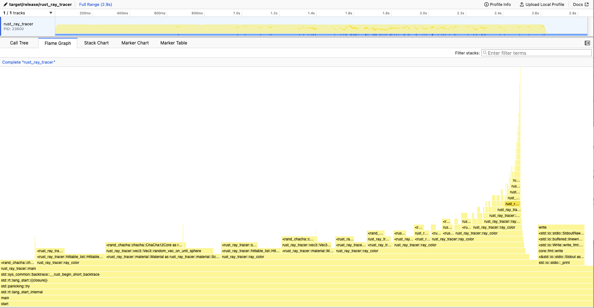
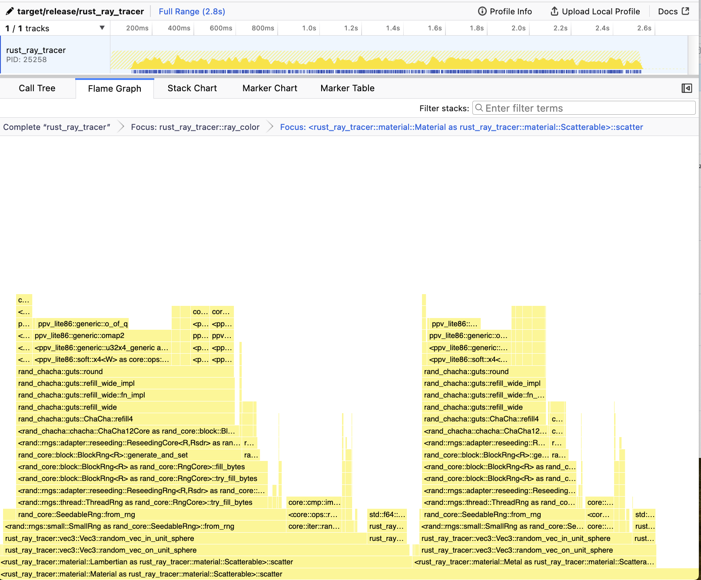

# Rust Ray Tracer
A follow through of https://raytracing.github.io/books/RayTracingInOneWeekend.html in rust.

Notes
- How can light bouncing between two colored objects with no absorption be modeled, without making the light darker?

Ideas
- Use a different color model besides RGB
  - Perceptual color models
  - Subtractive color models for materials
  - HSL / HSV for specifiying color


 # Benchmarking
https://nnethercote.github.io/perf-book/benchmarking.html

Hyperfine is used to benchmark the program. 

## Results

### December 2024
The best performance optimization came from parallelization. The final render took 2300 CPU seconds, but in real time took less than 3 minutes, a 14x faster render! I used rayon to parallelize because each pixel and ray is independent from others, so it's easy to drop in `par_iter` instead of `iter`.

### Preliminary Results (before any optimizations) Sunday July 14
Using `hyperfine "cargo run --release"`.

```
Benchmark 1: cargo run --release
  Time (mean ± σ):      2.718 s ±  0.012 s    [User: 2.530 s, System: 0.019 s]
  Range (min … max):    2.699 s …  2.743 s    10 runs
```

#### Profiling
Profiling shows that the majority of the time is spent in the function `ray_color` which computes the color of each pixel in the camera by doing the following:

1) sending a ray from the camera origin towards the scene
2) checking for collisions and updating the hit record with color information
3) scattering the ray according to the material which was hit
4) repeat recursively with the new ray


In the profiler we see that 23% of the time is spent in the function `scatter` (step 3) and 14% of the time is spent in `hit` which calculates whether a ray hits an object. The rest of the time is spent recursively calling `ray_color`. Inside `scatter`, the function `<rand_chacha::chacha::ChaCha12Core as rand_core::block::BlockRngCore>::generate` takes up 65% of the time.

Assuming that each recursive call spends a similar amount of time in `scatter`, that implies that generating random numbers takes up 40% of the runtime of `ray_color`. (23% * 65% / (23% + 14%)).

### Changing to SmallRng
Based on the results from profiling, I changed the implementation of the RNG function to use a faster prng method. The default impl is a cryptographic rng algorithm called ChaCha12, which runs slower than rng algorithms that are not designed to be cryptographically secure. 

Results:
```
hyperfine "cargo run --release"
Benchmark 1: cargo run --release
  Time (mean ± σ):      2.619 s ±  0.002 s    [User: 2.433 s, System: 0.017 s]
  Range (min … max):    2.614 s …  2.622 s    10 runs
```

Too bad I only saved about 0.1s! Hopefully profiling will show why the performance is still slow.

#### Profiling
Here the is the profiler output focussing on the `scatter` function.



Here we can see that seeding the `SmallRng` with the `from_rng` is taking up about 60% of the time still. SmallRng takes a seed which is currently being generated with the same cha cha function. I thought that eliminating most of the calls to the cryptographic rng function would be enough, but it looks like I need to eliminate it completely from this code path. I could make a global SmallRng object which gets reused over all calls instead. The cryptographic rng functions have a nice struct to handle this already, called `ThreadRng`, which handles lazily creating and using a thread local rng object, but it cannot be used with `SmallRng`. Perhaps in the future I can also use the [thread_local!](https://doc.rust-lang.org/std/macro.thread_local.html) macro.