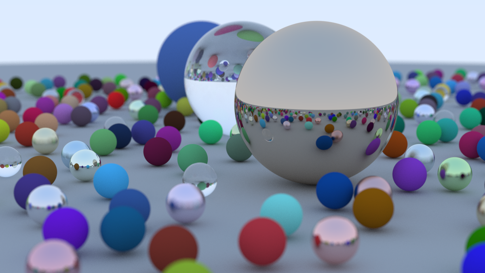

# Rust Ray Tracer
A brute force physics-based ray tracer for rendering scenes. It supports rendering Lambertion (solids), reflective (metal) and refractive (glass) materials. The camera position and angle can be customized, along with the fov and focal distance. Rendering is parallelized to take advantage of multiple cores, rendering the final scene below 14x faster, from 38 to 3 minutes. Using [Rayon](https://docs.rs/rayon/latest/rayon/), parallelizing pure functions like ray tracing is extremely simple.

## Process
Here's a gif of the progression of renders showing the ray tracer's development over time.

# Acknowledgements
This project draws heavily from Peter Shirley's ray tracing in one weekend [book](https://raytracing.github.io/books/RayTracingInOneWeekend.html), but adapted for Rust.
